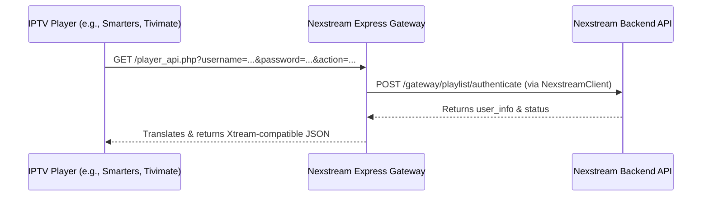

# Nexstream Express Gateway

`Nexstream Express Gateway` is a high-performance Express.js-based middleware and API gateway. It translates Xtream Codes compatibility requests (used by various IPTV player applications) into authenticated requests routed to the Nexstream backend API.

By acting as a proxy layer, it permits IPTV players to connect using the standard Xtream Codes credentials protocol while utilizing Nexstream's secure backend client services.

---

## Architecture Overview

The gateway intercepts client requests and uses the internal `NexstreamClient` to validate credentials, retrieve live categories/streams, and generate authorized temporary stream playback links.



---

## Features

- **Xtream Codes Compatibility Layer**: Supports common endpoints queried by player applications, mapping them to Nexstream actions:
  - `authenticate` / Default login validation
  - `get_live_categories` for retrieving live stream categories
  - `get_live_streams` (optionally filtered by `category_id`)
- **Live Playback Redirects**: Handles `/live/:username/:password/:stream` requests by requesting playlinks and redirecting the player to the underlying media stream (`.m3u8`, `.ts`, etc.).
- **Automatic Client IP Forwarding**: Automatically identifies client IP addresses for location-bound stream generation and logging.
- **Robust Error Handling**: Integrated `GlobalErrorHandlerMiddleware` catches and responds to backend failure modes cleanly.

---

## Getting Started

### Prerequisites

- [Node.js](https://nodejs.org/) (v18+ recommended)
- npm or yarn

### Installation

1. Clone the repository:
   ```bash
   git clone <repository-url>
   cd NexstreamExpressGateway
   ```

2. Install dependencies:
   ```bash
   npm install
   ```

3. Configure Environment Variables:
   Create a `.env` file in the root directory:
   ```env
   PORT=3000
   API_BASE_URL=https://your-nexstream-api-domain.com/api/v1
   NEXSTREAM_API_KEY_ID=your_api_key_id
   NEXSTREAM_API_KEY=your_api_key_secret
   ```

---

## Configuration Variables

| Variable | Description | Default |
| :--- | :--- | :--- |
| `PORT` | Port number the Express application listens on | `3000` |
| `API_BASE_URL` | Nexstream backend API base URL | `http://localhost:8000/api/v1` |
| `NEXSTREAM_API_KEY_ID` | API credential ID for the Nexstream API | *(Required)* |
| `NEXSTREAM_API_KEY` | API credential secret key for the Nexstream API | *(Required)* |

---

## API Documentation

### 1. Xtream Codes API Proxy
* **Endpoint**: `GET /player_api.php`
* **Query Parameters**:
  - `username` (string): Client username
  - `password` (string): Client password
  - `action` (string): Optional action to execute. Supported actions:
    - `authenticate` (default): Checks user info, expiration date, and playlist capabilities.
    - `get_live_categories`: Returns list of category objects `[{ category_id, category_name, parent_id }]`.
    - `get_live_streams`: Returns live streams list. Supports filtering via optional query param `category_id`.

### 2. Live Stream Endpoint
* **Endpoint**: `GET /live/:username/:password/:stream`
* **Description**: Authenticates the request and fetches the temporary playlink. Sends a HTTP `302 Found` redirect if the playlink is a redirect URL, or writes the playlist output as `application/x-mpegURL` format.

---

## Directory Structure

```
NexstreamExpressGateway/
├── src/
│   ├── config/             # Environment configuration mapping
│   │   └── app.ts
│   ├── controllers/        # Express router controller endpoints
│   │   ├── live_player_controller.ts
│   │   └── xtream_controller.ts
│   ├── lib/                # Shared utilities & Nexstream API Client
│   │   └── nexstream_client.ts
│   ├── middleware/         # Custom Express middlewares (error handlers, logs)
│   │   └── global_error_handler.ts
│   ├── services/           # Business logic layer
│   │   ├── auth/           # Authentication handlers
│   │   └── live/           # Live streams and category fetching logic
│   ├── types/              # TypeScript declaration structures
│   └── main.ts             # Application entry point
├── package.json
└── tsconfig.json
```

---

## Scripts

Run scripts from the root directory:

* **Start in Development Mode** (utilizes `tsx watch` for hot-reload):
  ```bash
  npm run dev
  ```
* **Build Project**:
  ```bash
  npm run build
  ```
* **Start Production Server**:
  ```bash
  npm run start
  ```
